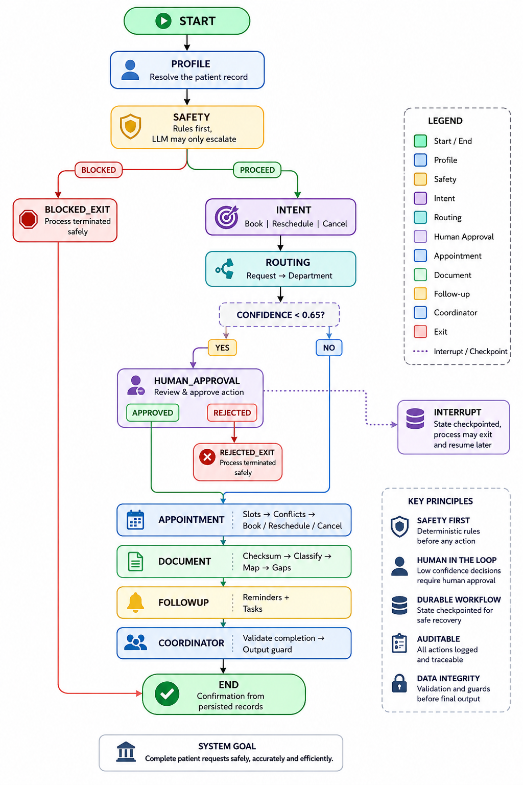

# AgentCare

[](https://github.com/Basie12/AgentCare/actions/workflows/ci.yml)

Agentic AI for hospital administration — registration, department routing, appointment booking, document coordination, reminders and follow-up. Clinical decisions stay with clinicians; the system is built so it *cannot* wander into them.

Built with **LangGraph** (orchestration + checkpointing), **FastAPI + Jinja2** (UI and API), **SQLAlchemy** (SQLite or Postgres), and a **provider-agnostic LLM layer** (Groq, OpenAI, Anthropic, Gemini, OpenRouter or local Ollama).

---

## Quick start

```bash
git clone <your-repo-url> && cd agentcare
python -m venv .venv && source .venv/bin/activate   # Windows: .venv\Scripts\activate
pip install -r requirements.txt

cp .env.example .env          # add GROQ_API_KEY (free at console.groq.com)
python -m app.db.seed         # synthetic departments, doctors, slots, demo users
uvicorn app.main:app --reload
```

Open http://localhost:8000.

| Role    | Email               | Password    |
|---------|---------------------|-------------|
| Patient | patient@demo.local  | patient123  |
| Staff   | staff@demo.local    | staff123    |
| Admin   | admin@demo.local    | admin123    |

New patients can register at `/register` — the demo accounts are for convenience, not the only way in.

Run the tests: `pytest -q` (90 tests, ~14s).

Tests run against deterministic fallbacks with an isolated database — no live
LLM calls, so the suite is fast, free and reproducible, and it never touches
the database you demo from. To exercise a real provider instead:
`AGENTCARE_TEST_LIVE_LLM=1 pytest -q`.

**No API key?** The app still runs. Every agent has a deterministic fallback, and workflows are flagged `degraded=true` in the UI rather than silently pretending an agent ran.

### Choosing an LLM

Set two variables in `.env`. No code changes:

```bash
LLM_PROVIDER=groq                      # groq | openai | anthropic | gemini | openrouter | ollama | custom
LLM_MODEL=llama-3.3-70b-versatile
GROQ_API_KEY=gsk_...                   # only the key matching your provider
```

| Provider | Key | Notes |
|---|---|---|
| `groq` | `GROQ_API_KEY` | Free tier, fastest inference. Default. |
| `openai` | `OPENAI_API_KEY` | |
| `anthropic` | `ANTHROPIC_API_KEY` | JSON enforced by prompt + parser, not a flag |
| `gemini` | `GOOGLE_API_KEY` | Free tier at aistudio.google.com |
| `openrouter` | `OPENROUTER_API_KEY` | One key, many models — useful for A/B testing |
| `ollama` | *none* | Fully local, offline, no rate limits |
| `custom` | `LLM_API_KEY` + `LLM_BASE_URL` | Any OpenAI-compatible endpoint (vLLM, Together, LM Studio) |

Everything except Anthropic runs through the OpenAI SDK against a different `base_url`, so adding a provider is one line in `PROVIDERS` (`app/agents/llm.py`).

Verify before demoing — model IDs change without notice:

```bash
python -m scripts.check_llm
```

It prints the models your key can actually reach, warns if `LLM_MODEL` isn't among them, and sends one live request through the same `complete()` path the agents use.

---

## Architecture


State is checkpointed to SQLite after **every** node. When `human_approval` calls `interrupt()`, the run is durably paused — you can kill the server, restart it, and the workflow still resumes from that exact checkpoint once a staff member records a decision.

### Agents

Each agent has its own prompt file, its own tool allowlist, and its own slice of state. Calling a tool outside the allowlist raises `ToolPermissionError` — the separation is enforced, not just documented.

| Agent | Prompt | Tools it may call | Reads → writes |
|---|---|---|---|
| `profile` | pure logic (no LLM) | `get_patient_record` | `patient_id` → `patient` |
| `intent` | pure logic (no LLM) | — | `request_text` → `appointment_intent`, `timeframe` |
| `safety` | `app/prompts/safety.md` | `create_escalation`, `record_safety_event` | `request_text` → `safety_verdict`, `blocked`, `escalation_id` |
| `routing` | `app/prompts/routing.md` | `list_departments`, `create_escalation` | `request_text` → `department`, `routing_confidence` |
| `appointment` | pure logic (no LLM) | `find_available_slots`, `book_appointment`, `reschedule_appointment`, `cancel_appointment`, `list_patient_appointments` | `department`, `request_text` → `appointment`, `appointment_intent`, `timeframe` |
| `document` | `app/prompts/document.md` | `check_document_duplicate`, `store_document`, `list_patient_documents`, `check_missing_documents` | `uploaded_files`, `department` → `documents`, `duplicates`, `missing_documents` |
| `followup` | `app/prompts/followup.md` | `create_reminder`, `schedule_appointment_reminders`, `find_incomplete_workflows` | `appointment`, `missing_documents` → `reminders` |
| `coordinator` | `app/prompts/coordinator.md` | `get_patient_record`, `list_patient_documents` | all agent output → `final_message` |

### Tools (14 registered)

Every tool reads or writes the database. None returns a canned response. The `@tool` decorator writes a `ToolInvocation` row and an `AuditEvent` row on every call, captures errors instead of propagating them, and enforces the per-agent allowlist.

---

## Safety design

RULE-5 compliance does not depend on a model behaving well. Three deterministic layers wrap the LLM:

1. **Pre-triage** (`app/safety/triage.py`) — runs *before* any LLM call. Pattern-matches emergency signals (chest pain, breathing difficulty, self-harm, overdose) and clinical-advice requests (diagnosis, prescription, dosage). Cannot be prompt-injected away. The LLM that runs afterwards may only *escalate* the verdict, never downgrade it.
2. **PII redaction** (`app/safety/pii.py`) — email, phone, SSN, MRN, DOB, insurance ID and street addresses are tokenised before any text leaves the process. Values are restored locally afterwards.
3. **Output guard** (`app/safety/guard.py`) — every generated string is scanned for dosage patterns (`\d+\s?(mg|ml|mcg)`), drug-name stems, diagnosis assertions and treatment instructions. A hit suppresses the text, substitutes an administrative-only message, and writes a `SafetyEvent` row.

Emergencies and clinical questions halt the workflow, create an `Escalation`, and surface emergency guidance. Nothing is booked on a blocked run.

---

## Where each requirement is implemented

| Requirement | Location |
|---|---|
| Python backend | `app/` |
| LLM integration | `app/agents/llm.py` — 7 providers behind one interface, retries via tenacity, graceful degradation |
| ≥3 distinct agent roles | `app/agents/nodes.py` — 6 agents, separate prompts in `app/prompts/`, tool allowlists enforced in `app/tools/registry.py` |
| ≥3 functional tools | `app/tools/hospital.py`, `app/tools/documents.py`, `app/tools/oversight.py` — 14 total |
| Persistent SQL database | `app/db/models.py`, `app/db/base.py` (SQLite default, Postgres via `DATABASE_URL`) |
| Persistent workflow/agent state | `SqliteSaver` checkpointer in `app/agents/graph.py` + `WorkflowRun.state` mirror in `app/services.py` |
| User interface | `app/web/routes.py`, `app/web/templates/` |
| RBAC in the backend | `app/auth/deps.py` — `require_staff`, `assert_owns_patient` |
| Human escalation / approval | `human_approval` node (`interrupt`) + `resolve_escalation()` in `app/services.py` + staff console |
| Audit logging | `AuditEvent` written by the `@tool` decorator and every state transition |
| Error handling / retry | `tenacity` retries in `llm.py`; slot-walk retry in `appointment_agent`; `@agent_node` and `@tool` capture failures |
| Environment config | `app/config.py`, `.env.example` |
| Synthetic sample data | `app/db/seed.py` (Faker, fixed seed 42) |
| Tests | `tests/test_agentcare.py` (25 tests) |

### Completion validation

The coordinator does not narrate success it cannot verify. Before writing the patient's confirmation it runs `validate_completion()`, which grades the run against the operation that was requested:

- the requested operation actually happened (booked / rescheduled / cancelled)
- the appointment is **readable from the database**, not merely present in agent state
- every uploaded file was either stored or identified as a duplicate
- an active appointment has reminders
- no agent reported an error

A failed check writes an `incomplete_workflow` escalation and marks the run `completed_with_gaps` rather than sending a cheerful confirmation for work that did not happen.

### Appointment operations

The appointment agent detects whether a request is a **book**, **reschedule** or **cancel** before touching the database (`app/agents/intent.py`), so *"move my Cardiology appointment to Friday"* and *"please cancel my appointment"* work as prose, not just as buttons. Detection is deterministic for the same reason as timeframe parsing.

Two safety properties are deliberate:

- **Ambiguous text defaults to BOOK.** A wrong booking is an extra a human can remove; a wrong cancellation destroys care someone was relying on. Cancellation requires an explicit cancellation verb.
- **Ambiguity escalates rather than guesses.** Two live appointments and no way to tell which one "cancel my appointment" refers to raises an escalation instead of picking one.

Cancel and reschedule skip the department-confidence gate — the existing appointment already knows its department, so *"cancel my appointment"* never escalates for lacking one.

All three operations are also available directly from the patient dashboard, with ownership enforced in the backend (`assert_owns_patient`).

### Scheduling preferences

The appointment agent parses the patient's stated timing before searching for slots — *"next week"*, *"tomorrow morning"*, *"Friday afternoon"*, *"in two weeks"*, *"on August 3"*, *"ASAP"*. Parsing is deterministic (`app/agents/timeframe.py`), not an LLM call: a hallucinated appointment date is worse than no date, and this runs inside the booking path.

Slots inside the requested window rank first; slots on the right day but wrong time of day rank second; everything else is kept as a fallback so a booking still happens rather than failing outright. The workflow page shows the requested timing alongside a **met** / **not available** badge, and `appointment.timeframe_honoured` records it in the database.

### Data model

`User`, `PatientProfile`, `Department`, `Doctor`, `AppointmentSlot`, `Appointment`, `PatientDocument`, `WorkflowRun`, `Reminder`, `Escalation`, `AuditEvent` — plus `AgentTrace`, `ToolInvocation` and `SafetyEvent`, which make agent behaviour reviewable rather than merely claimed.

Two database-level guarantees worth naming:
- A partial unique index on `appointments.slot_id` (live statuses only) makes double-booking impossible even under concurrency.
- A unique constraint on `(patient_id, checksum)` makes duplicate documents impossible to store twice.

---

## Observability

Open any workflow at `/workflow/{id}` to see every agent that ran in order, its latency, model, token usage, whether it fell back to deterministic logic, and what it wrote to state — plus every tool call with arguments and results, and any safety events. Staff see a live audit log at `/staff`.

---

## Demo scenarios

1. **Happy path** — *"I need a Cardiology follow-up next week and want to attach my old ECG."* → routed, booked, ECG classified and filed, missing referral letter flagged, 4 reminders scheduled.
2. **Duplicate document** — re-upload the same file → checksum match, stored once, patient told when the original was filed.
3. **Emergency** — *"I have chest pain, what dose of aspirin should I take?"* → workflow halts at the safety agent, emergency guidance shown, escalation raised, nothing booked.
4. **Ambiguous request** — *"I need to see someone about a thing."* → routing confidence below threshold → `interrupt()` → staff console → approve with a department override → **workflow resumes from the checkpoint** and completes the full booking.
5. **RBAC** — a patient hitting `/staff` gets 403 from the backend, not a hidden button.

---

## Notes

All data in this repository is synthetic, generated by Faker with a fixed seed. No real patient data, credentials or production tokens are committed. AgentCare performs administrative coordination only; it does not diagnose, prescribe, advise on dosage, or replace a healthcare professional.
